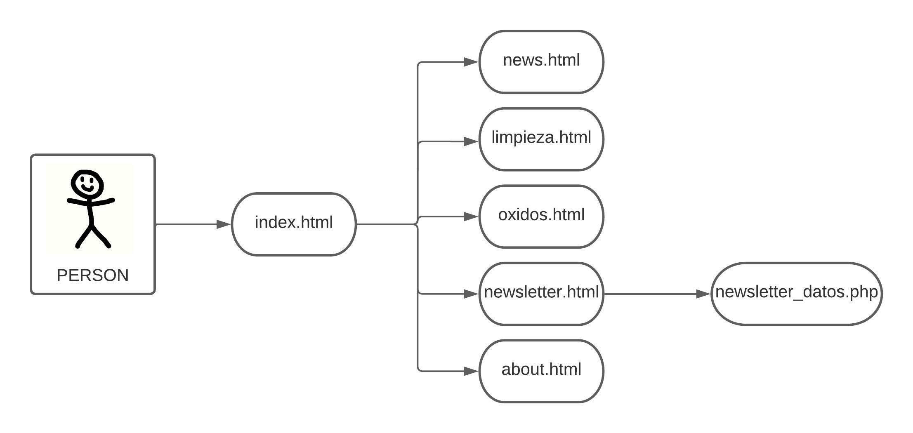

# Proyecto: Camperizacion de furgoneta

## Hecho por Irene Martinez

### Links de interes:

- [GitHub](https://github.com/iremarmae/proyecto_objetos)

- [Pages](http://www.fragonetti.tk/)

### Informacion basica del proyecto:

1.  Se ha creado un proyecto de pagina web con lenguaje CSS y HTML.
2.  Se trata de una web con contenido sobre camperizacion de furgonetas. En ella se podra seguir el proceso de camperizar una furgoneta desde el inicio. Se incluye un formulario para subscribirse a la Newsletter y asi poder estar al dia con los nuevos articulos incluidos en la web, o recibir furgoconsejos.
3.  Se incluyen imagenes y videos para facilitar la comprension del proceso de camperizacion.

### UML

